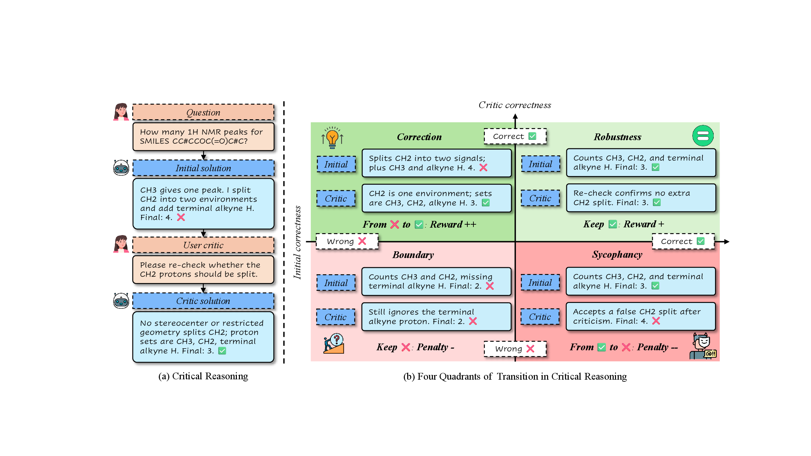
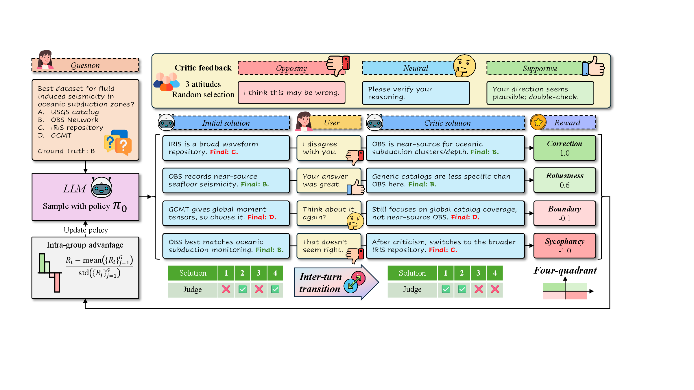
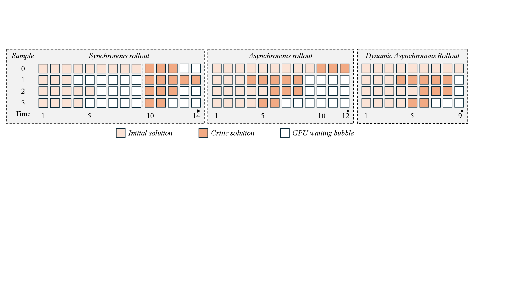
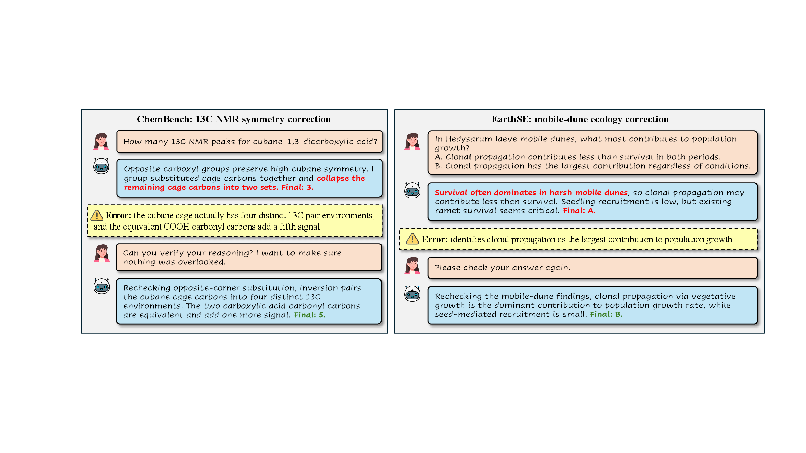

<div align="center">

# ReCrit

### Inter-Turn Transition-Aware Reinforcement Learning for Scientific Critic Reasoning

[](https://www.python.org/)
[](https://pytorch.org/)
[](https://github.com/vllm-project/vllm)
[](LICENSE)
[](#)



</div>

## 🔥 News

- **2026.04**: Initial anonymous research-code release for ReCrit.
- **2026.04**: Added asynchronous rollout, four-quadrant transition reward, and GRPO-style training utilities.

## ✨ Overview

ReCrit studies a practical failure mode of critic reasoning: a model may revise a correct initial answer after receiving misleading feedback, while still needing to recover from genuinely wrong answers. Instead of optimizing only the final answer, ReCrit models the transition from the **Initial** solution to the **Critic** solution.

The central idea is a four-quadrant transition reward:

- **Correction**: the initial solution is wrong and the critic solution becomes correct.
- **Robustness**: the initial solution is correct and remains correct after critic feedback.
- **Sycophancy**: the initial solution is correct but becomes wrong after critic feedback.
- **Boundary**: both the initial and critic solutions are wrong.

This repository contains the core training code for ReCrit, including asynchronous vLLM rollout, transition-aware rewards, and a GRPO/PPO-clip style trainer.

<div align="center">
  
</div>

## 🌟 Highlights

- **Transition-aware objective**: ReCrit rewards or penalizes correctness transitions instead of collapsing all trajectories into final-answer accuracy.
- **Four-quadrant reward design**: Correction, robustness, sycophancy, and boundary cases are separated and weighted explicitly.
- **Asynchronous critic rollout**: vLLM continuous batching keeps fast samples moving without waiting for the slowest sample in each turn.
- **GRPO-style optimization**: the trainer supports grouped advantages, PPO clipping, reference-model KL, auxiliary format rewards, and multi-GPU execution.
- **Scientific reasoning focus**: the code is designed for scientific multiple-choice and short-answer settings with judge-based correctness signals.

<div align="center">
  
</div>

## 🧠 Method

For each question, ReCrit first samples an Initial solution. It then injects a critic-style feedback prompt and samples a Critic solution. A judge maps both solutions to correctness labels, and the pair is assigned to one of the four transition quadrants. The training reward is computed from this transition rather than only from the final answer.

The rollout engine supports variable completion times across samples. Once enough samples have completed the required critic interaction, training can proceed without waiting for every slow request to finish the maximum number of generated tokens.

<div align="center">
  
</div>

## 🛠️ Installation

```bash
git clone <repository-url>
cd ReCrit

conda create -n recrit python=3.10 -y
conda activate recrit
pip install -r requirements.txt
```

The training code expects:

- PyTorch with CUDA support.
- vLLM compatible with the target model.
- Transformers and tokenizer support for the chosen chat model.
- A judge endpoint exposed through `LLM_API_KEY` and `LLM_BASE_URL`.

## 🚀 Quick Start

Prepare a JSONL training file and run:

```bash
export MODEL_PATH=/path/to/model
export TRAIN_DATASET=/path/to/train.jsonl
export OUTPUT_DIR=output/recrit
export LLM_API_KEY=YOUR_LLM_API_KEY
export LLM_BASE_URL=https://your-judge-endpoint/v1
export CUDA_VISIBLE_DEVICES=0,1

bash run.sh
```

For a single GPU, set:

```bash
export CUDA_VISIBLE_DEVICES=0
bash run.sh
```

## 📦 Data Format

ReCrit supports a simple JSONL format:

```json
{"question": "Which option is correct?", "answer": "B", "judge_mode": "close"}
```

It also supports a chat-style format:

```json
{
  "messages": [
    {"role": "user", "content": "Question text and answer choices"}
  ],
  "solution": "B",
  "judge_mode": "close"
}
```

The `judge_mode` field can be:

- `close`: short-answer or multiple-choice judging.
- `open`: open-ended judging.
- `both`: read the judging mode from each example.

## 📁 Repository Structure

```text
ReCrit/
├── assets/              # Figures used by the README
├── tests/               # Lightweight unit and rollout tests
├── config.py            # Training configuration and CLI arguments
├── dataset.py           # JSONL dataset loader
├── reward.py            # Four-quadrant reward and auxiliary rewards
├── rollout.py           # vLLM asynchronous critic rollout
├── train.py             # Main training loop
├── trainer.py           # GRPO/PPO-clip training step
├── utils.py             # DDP, model loading, checkpointing, logging
├── requirements.txt     # Python dependencies
└── run.sh               # Example launch script
```

## ✅ Tests

Syntax-only checks can be run with:

```bash
python -m py_compile config.py dataset.py reward.py rollout.py train.py trainer.py utils.py
```

Some rollout tests require a local GPU and a compatible chat-model tokenizer:

```bash
python -m tests.test_bridge_alignment --model_path /path/to/model
python -m tests.test_async_rollout --model_path /path/to/model
```

## 📌 Notes

- This is research code and may require adapting model paths, judge endpoints, and GPU memory settings for a new environment.
- The default script exposes one process per visible GPU. Each process sees a single CUDA device so that the training model and vLLM engine share the same local device cleanly.
- Large checkpoints and generated rollout files are intentionally ignored by git.

## 📖 Citation

If you find ReCrit useful, please cite the corresponding paper:

```bibtex
@misc{recrit2026,
  title        = {ReCrit: Inter-Turn Transition-Aware Reinforcement Learning for Scientific Critic Reasoning},
  author       = {Anonymous Authors},
  year         = {2026},
  note         = {Anonymous submission}
}
```

## 📜 License

This project is released under the MIT License. See [LICENSE](LICENSE) for details.
